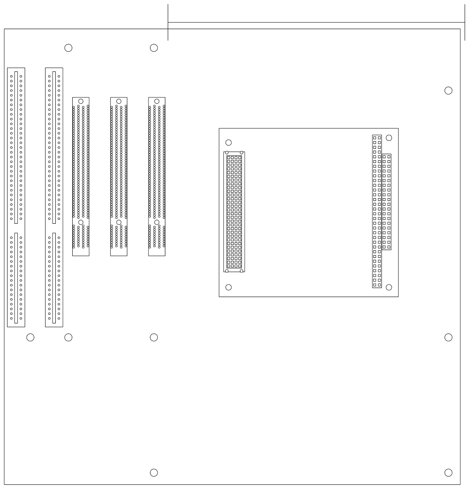

# Universal ISA Backplane

*Initial layout plan*

This backplane is initially intended to be used with with a [PC/104 compute board][https://en.wikipedia.org/wiki/PC/104] for legacy ISA card applications. It aims to implement the complete 16-bit ISA bus specification in a microATX form factor. In future, the PCI bus could also be implemented, allowing use of PC/104+ (ISA and PCI), or PCI/104 (PCI only) compute boards.

This project was based on [spark2k06's Universal ITX Backplane][https://github.com/spark2k06/Universal-ITX-Backplane], but is heavily modified to focus on PC/104 support and in a microATX form factor. More information visit spark2k06's project on their Hackaday page: https://hackaday.io/project/175340-universal-itx-backplane.

The project is mostly unfinished. No layout exists, most of the schematic is unfinished.

## Specifications

* 4-Layer microATX board
* 2x ISA 8-/16-bit slots (1 shared with PCI slot)
* 3x 32-bit PCI slots (1 shared with ISA slot)
* 1x PC/104, PC/104+, PCI-104 connection
* Compatibility with modern ATX power supplies
* Compatibility with modern ATX computer cases
* Standard ATX I/O shield area with connectors bringing PC/104 connections to the rear of an ATX case